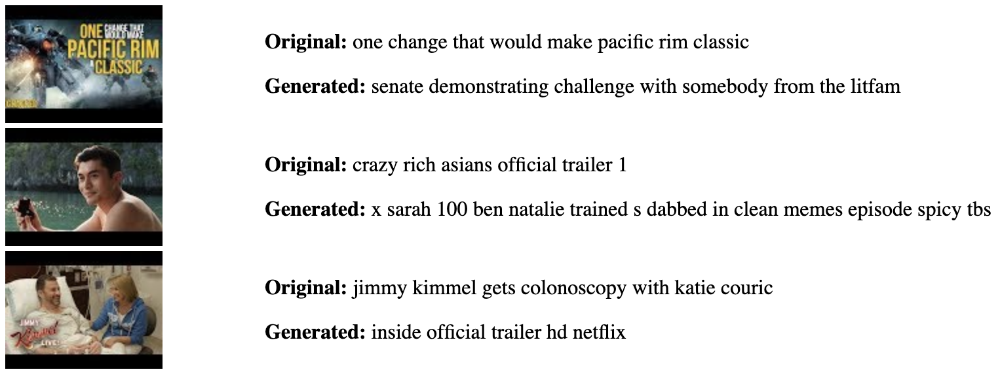
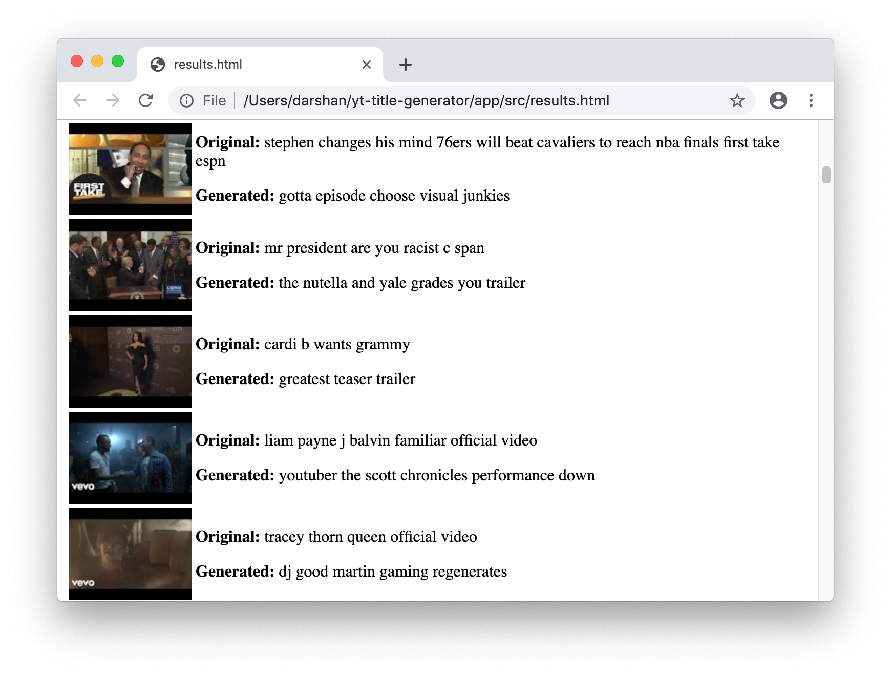

# YouTube Title Generator

Generate titles for YouTube thumbnails using an image captioning LSTM
([Long-Short Term Memory](https://en.wikipedia.org/wiki/Long_short-term_memory)) model.

Do you watch a lot of YouTube like me and realized how thumbnails typically
follow a particular style? Do you notice just how non-sensical
(and sometimes [clickbaity](https://en.wikipedia.org/wiki/Clickbait)) some titles can be? Well I have and thought
it would be funny to generate my own. Using this code, you can generate some quality `h o t` `t a k e s` such as these:



Ahh yes, the `senate challenge with somebody from the litfam`...

### Description

Below are descriptions of the core files in this repo:

```
.
├── app
│   └── src
│       ├── generate_captions.py
│       ├── train.py
│       ├── model.py
│       ├── results.py
│       └── training_data.py
```

* `app/src/generate_captions.py`: Script to generate YouTube titles
* `app/src/train.py`: Caption model training script
* `app/src/model.py`: Caption model architecture
* `app/src/results.py`: View results in UI
* `app/src/training_data.py`: Download and prepare data

### Requirements

* Python 3
* pip 3
* TensorFlow configured to use a GPU (recommended)

### Getting Started

The dataset used to train this model can be found on [Kaggle](https://www.kaggle.com/datasnaek/youtube-new/version/114).
If you don't have a Kaggle account, you will need to sign up for one to download the dataset.
You will need `USVideos.csv`, however you may use the other datasets if you wish.
Add the file to the `app/resources/` directory.

Next, install the dependencies using:

```
$ make deps
```

### Downloading and Preparing Data

To download and prepare the data used for training and testing, run the following
commands:

* `$ make thumbnails`: Download the YouTube thumbnails
* `$ make titles`: Prepare the titles
* `$ make features`: Download the VGG16 image features

### Training the Model

Train the captioning model by running the following command:

```
$ python3 app/src/train.py
```

Training the model can take a very long time. If you use a GPU, it will take
considerably less time to train.

### Generate Some Captions!

To see what kind of titles your model can generate, run:

```
$ python3 app/src/generate_captions.py
```

then afterwards:

```
$ python3 app/src/results.py
```

This will create a file called `results.html` which you can open in your
browser and view your creations!



### Acknowledgements

The caption model used was adapted from [this tutorial over at Machine Learning Mastery](https://machinelearningmastery.com/develop-a-deep-learning-caption-generation-model-in-python/).

Further reading:
* [Where to put the Image in an Image Caption Generator, Tanti et al.](https://arxiv.org/abs/1703.09137)
* [What is the Role of Recurrent Neural Networks (RNNs) in an Image Caption Generator?, Tanti et al.](https://arxiv.org/abs/1708.02043)
